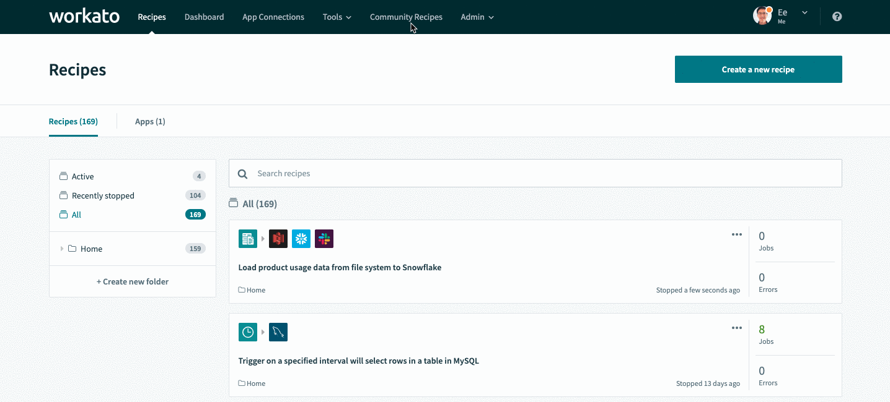

# On-premises Agent
Enterprises have on-premises applications and databases that are deployed within their corporate datacenter. These apps are protected via firewalls, and therefore are typically not easily accessible to cloud services like Workato.

The Workato on-premises agent provides a secure way for Workato to selectively access customer-authorized on-premises apps, databases and folders without having to open **ports** in the corporate firewall.

On-premises access is enabled only for certain plans. Check the [Pricing and Plans page](https://www.workato.com/pricing?audience=general) or reach out to Workato sales representatives at **+1 (844) 469-6752** to find out more.

For Workato accounts with on-premises access, users are able to view the on-premises option in the Tools menu.

*On premise menu option*

## Overview
The following is a conceptual model of Workato's on-premises agent and how it interacts with databases and applications behind the firewall.

*Conceptual model for on-premises agent and connector*

Workato on-premises connectivity has 2 core components:

- Tunneling
- Database and filesystem access.

The on-premises agent runs within the customer’s data center, behind the firewall, and establishes a TLS websocket tunnel to connect out to Workato.

The on-premises agent can be configured to access the selected databases and filesystems behind the firewall. Since 2.2.x it also supports connections to [JMS-compliant systems](/connectors/jms.md).

## Supported operating systems
The on-premises agent runs on the following systems:

- Linux (64-bit)

- Windows 7, 10 (64-bit)

- Mac OS X

Minimum hardware requirements for the system running the on-premises agent are:

- 8GB of RAM
- 250 MB of disk space
- 800 Mhz 64-bit CPU (Intel/AMD).

[Detailed instructions on how to set up for each operating system](https://docs.workato.com/on-prem/setup.html)

## Common errors when using the on-premises agent
If connecting to on-premises applications fail, check that:
- Selected agent is active
- Credentials provided in the app connection are correct
- Credentials of user provided in the app connection has correct role and permission to connect

If connecting to on-premises databases fail, check that:
- Selected agent is active
- Credentials provided in the connection profile are correct
- Database name and type provided in the connection profile is correct

## Example recipes

### Example on-premises database recipes
- [Salesforce case sync with on-premises SQL Server](https://www.workato.com/recipes/280605)
<!-- [Quickbase data sync with SQL Server](https://www.workato.com/recipes/280610-demo-qb-data-sync-with-sql-server#recipe)
[On-prem Postgres sync with Postgres](https://www.workato.com/recipes/268936)-->
